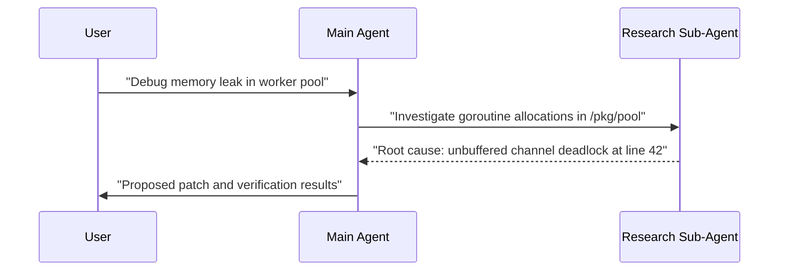

Through reverse engineering, this article provides a deep dive into the internal architecture and working principles of Anthropic's AI coding assistant, Claude Code. It breaks down the collaborative mechanisms of its Main and Sub-Agents, system prompts, toolset definitions, and context management strategies, helping you to fully understand the autonomous execution flow of this powerful AI tool.

## Architectural Architecture

Modern agentic assistants move beyond naive single-prompt completions to structured execution loops:

- **Orchestration Loop**: Evaluates user prompts, assesses codebase context, formulates multi-step plans, and invokes specialized tools.
- **Tool Protocol**: Strictly typed function definitions for file inspection, grep/find operations, bash command execution, and subagent delegation.
- **State Compaction**: Automatic context pruning to preserve long-horizon conversation fidelity without hitting token limits.

### Sub-Agent Coordination

By isolating exploratory tasks (such as searching broad repositories or running read-only diagnostic checks) inside dedicated subagent contexts, the primary agent maintains a clean reasoning trajectory.

This decoupled design is essential for tackling complex software engineering challenges autonomously.
